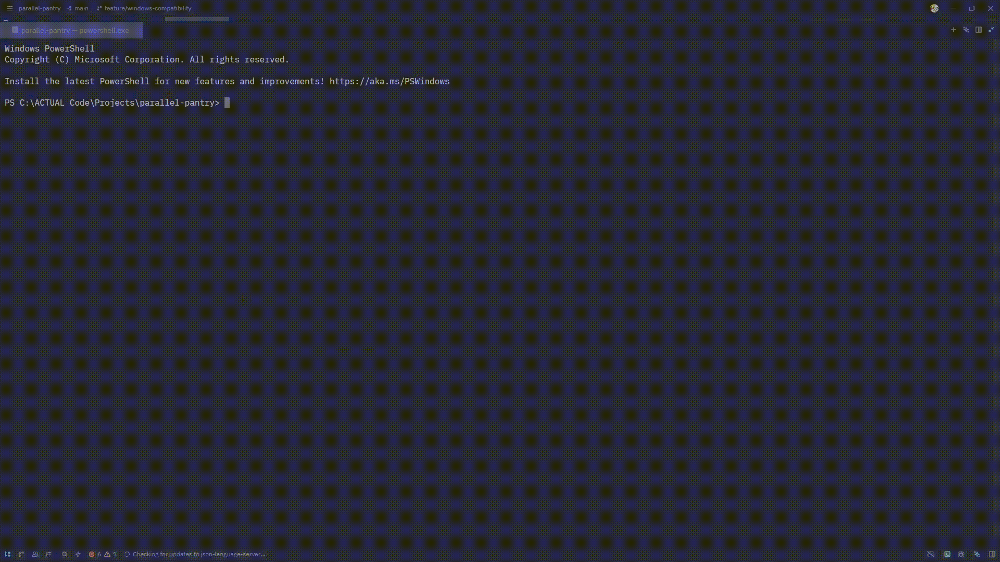

# 🍽️ Parallel Pantry: MPI-Based Order Processing System


## 💭 Reflection Questions

### 1. Why did we combine MPI with multiprocessing concepts in this activity?
MPI handled distributed communication between ranks (master-to-worker messaging), while multiprocessing concepts (`Manager().list()` and `Lock`) handled safe shared-state behavior. Using both showed how inter-process messaging and local synchronization solve different concurrency problems.

### 2. What behavior did we observe when running without `Lock()`?
Order completion became non-deterministic across runs, and write operations had no explicit critical-section protection. Even when outputs were complete in this setup, the pattern exposed how unsafe shared writes can become as concurrency complexity increases.

### 3. How did `Lock()` improve reliability?
`Lock()` serialized shared list writes so only one writer entered the critical section at a time. This made shared-memory updates explicit, easier to reason about, and safer for scaling or future modifications.

### 4. What role did `time.sleep()` play in the simulation?
Random delays simulated realistic workload differences and forced workers to complete independently. This made concurrency visible and highlighted why result order cannot be assumed in distributed processing.

### 5. What is the key lesson about deterministic vs non-deterministic outcomes?
Concurrent systems can be correct without fixed ordering, but correctness must be protected through synchronization and clear invariants (e.g., all orders processed exactly once). Deterministic critical sections are more important than deterministic finish order.

### 6. If we scale this system, what should we improve next?
Add stronger observability (timestamps, per-order lifecycle logs), introduce fault handling (worker failures/retries), and benchmark throughput under higher process counts. These changes would make the system more production-ready beyond functional correctness.

---

## 📌 Overview

**Parallel Pantry** is a simulation of a distributed order processing system built using **MPI (Message Passing Interface)** and Python’s **multiprocessing** tools.

The system demonstrates how tasks (orders) can be distributed from a **Master process** to multiple **Worker processes**, processed concurrently, and safely stored in shared memory using synchronization mechanisms.

This project highlights key concepts in **parallel and distributed computing**, including:

- Task distribution using MPI
- Concurrent execution across processes
- Shared memory management
- Race conditions and synchronization using locks

---

## 🧠 System Architecture

- **Master Process (Rank 0)**
  Responsible for generating orders and distributing them to workers.

- **Worker Processes (Rank > 0)**
  Receive orders, process them independently, and store results in shared memory.

- **Shared Memory (`Manager().list()`)**
  Stores processed orders accessible across processes.

- **Lock (`multiprocessing.Lock`)**
  Ensures that only one worker writes to shared memory at a time.

---

## ⚙️ Technologies Used

- Python
- mpi4py
- Open MPI
- multiprocessing

---

## 📁 Project Structure

```
parallel-pantry/
│
├── main.py                   # Main script (MPI + multiprocessing logic)
├── requirements.txt          # Python dependencies
├── README.md                 # Project documentation
├── .gitignore
├── experiments/
│   ├── main_no_lock.py       # Unsynchronized variant for QA comparison
│   ├── QA_TEST_REPORT.md
│   ├── SYNCHRONIZATION_ANALYSIS.md
│   ├── DELAYS_ANALYSIS.md
│   └── COMPLETION_REPORT.md
└── docs/
    └── execution-demo.gif    # Required demo artifact (to be added)
```

---

## 🚀 Setup Instructions

### 1. Clone the repository

```bash
git clone https://github.com/your-username/parallel-pantry.git
cd parallel-pantry
```

---

### 2. Create virtual environment

```bash
python -m venv venv
```

Activate:

```bash
# Mac/Linux
source venv/bin/activate

# Windows
venv\Scripts\activate
```

---

### 3. Install dependencies

```bash
pip install -r requirements.txt
```

---

### 4. Install MPI (Required)

#### Mac (Homebrew)

```bash
brew install open-mpi
```

#### Ubuntu/Debian

```bash
sudo apt install openmpi-bin openmpi-common libopenmpi-dev
```

#### Windows

Install MS-MPI from Microsoft:
https://learn.microsoft.com/en-us/message-passing-interface/microsoft-mpi

---

## ▶️ How to Run

```bash
mpirun -np 4 python main.py
```

- `-np 4` → 1 Master + 3 Workers
- Adjust depending on your system

---

## 🔄 Program Flow

1. Master generates 5–8 orders
2. Orders are distributed to workers using MPI
3. Workers process orders concurrently
4. Workers append results directly to shared memory via a `Manager().list()` proxy
5. `manager.Lock()` ensures safe, synchronized writing when enabled
6. Master prints final processed orders (collected from shared memory)

---

## 🔒 Synchronization Demonstration

### ❌ Without Lock

- Race conditions can occur when multiple workers append concurrently to the shared list without synchronization. The unsynchronized runs demonstrate nondeterministic ordering and potential interleaving artifacts.

### ✅ With Lock

- Using `manager.Lock()` serializes write access so only one worker appends at a time. Workers obtain the lock, append to the shared `Manager().list()` proxy, then release the lock — producing consistent and complete shared-state updates.

---

## 🧪 Sample Output

```
[MASTER] Starting system...
[MASTER] Sending Order_1 to worker 1
[MASTER] Sending Order_2 to worker 2
...

[MASTER] Final processed orders:
['Order_1 processed by worker 1',
 'Order_2 processed by worker 2',
 ...]
```

---

## Team Members & Roles

**Gerald Helbiro Jr.** (@potakaaa) - Lead 1
- Environment setup (MPI + mpi4py)
- Master process logic
- Task distribution
- Lock synchronization

**Hans Matthew Del Mundo** (@hdmGOAT) - Lead 2
- Worker execution logic
- Shared memory implementation (Manager.list)

**Ira Chloie Narisma** (@unripelo) - Lead 3
- Processing delays (time.sleep)
- Testing and quality assurance
- Test reports and analysis

**Vin Marcus Gerebise** (@areeesss) - Lead 4
- Documentation
- Repository organization

---

## 📊 Key Concepts Demonstrated

- Parallel processing
- Distributed task scheduling
- Inter-process communication (MPI)
- Shared memory coordination
- Race conditions and synchronization

---

## 🧾 Notes

- Ensure MPI is properly installed before running
- Always run using `mpirun`, not just `python`
- Reinstall `mpi4py` if MPI is installed after pip

---

## 📌 Submission Requirements

✔️ Complete working code
✔️ Demonstration of concurrency
✔️ Evidence of synchronization (with and without lock)
✔️ Organized repository with meaningful commits

---
## 🎥 Execution Demo GIF

Place the required run recording at:

`docs/execution-demo.gif`

Preview:



The GIF should clearly show:
1. Running via `mpirun -np 4 python main.py`
2. Concurrent worker processing
3. Master printing the final processed orders list

---

## 🎓 Final Thoughts

This project demonstrates how distributed systems coordinate tasks efficiently while maintaining data consistency. It emphasizes the importance of synchronization when multiple processes interact with shared resources.

---
